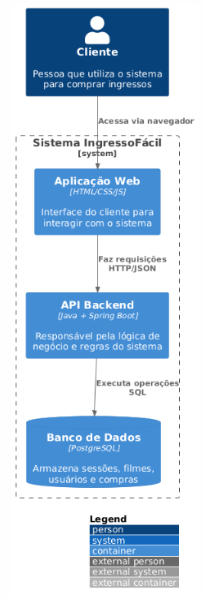

# README do Projeto

## Integrantes do Grupo
- [João Gabriel Maia]
- [Lucas Alves Resende]

## Diagramas do Projeto

### Diagrama de Arquitetura

### Diagramas de Comunicação
#### Cadastrar Filme/Evento

#### Comprar Ingresso

#### Escolher Assento

#### Selecionar Sessão

### Diagrama de Classes

### Diagrama de Componentes

### Diagrama de Implantação

### Diagrama Entidade-Relacionamento (ER)
.png)

### Diagramas de Estado
#### Ciclo de Vida de um Ingresso

#### Estado de um Assento

#### Estado de uma Sessão

### Diagramas de Sessão
#### Cadastrar Filme

#### Comprar Ingresso

#### Escolher Sessão

#### Selecionar Sessão

### Diagrama de Casos de Uso
.png)
